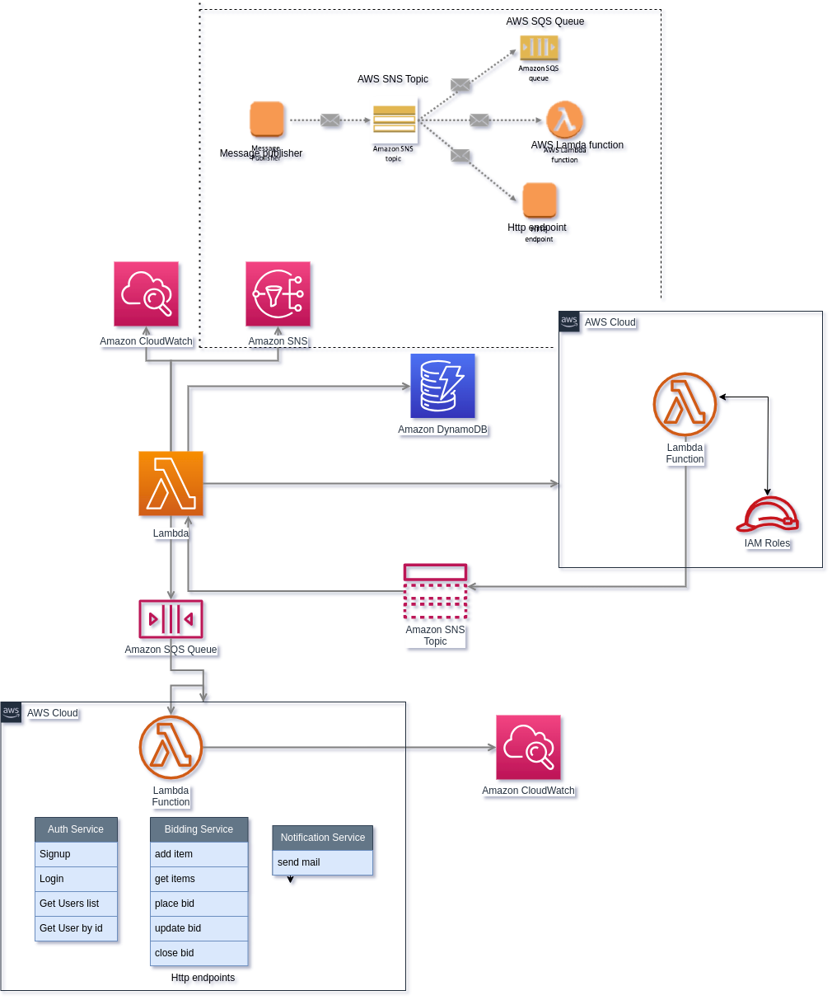

# sls-auction-system
To deploy the serverless project sls deploy

For deploying the selected version, use the below command sls deploy -f function-name

To see the function logs by using tail sls logs -f function-name -t

](auction_system.png)
